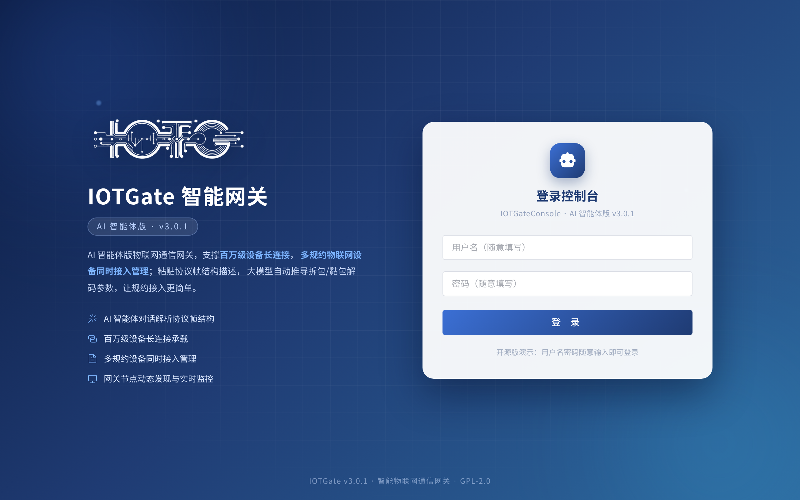
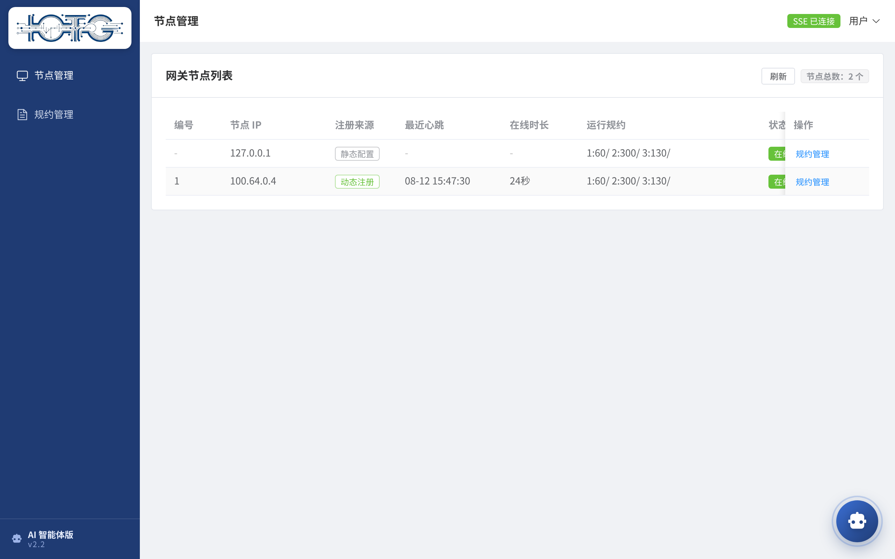

# IOTGate —— 高性能物联网智能网关（Netty 多规约）

> Java 版基于 **Netty** 的物联网高并发智能网关，支持多规约解析与设备接入，单机/集群灵活部署。
> **v3.0.1 全新升级为 AI 智能体版本**，与 [IOTGateConsole](https://gitee.com/willbeahero/IOTGateConsole) 智能体控制台配套，形成「网关 + AI 智能体管理平台」完整部署形态。

[](https://BrianApple.github.io/docs/iotgate/intro)
[](https://gitee.com/willbeahero/IOTGate)
[](LICENSE)

> **版本升级公告（2026-08）**：IOTGate **全新升级为 AI 智能体版本（v3.0.1）**——粘贴协议**帧结构描述**，大模型自动提取长度域信息、推导拆包/黏包解码参数，一键填充规约表单；支持动态节点发现（`-c -r` 主动注册 + 10s 心跳 + 404 自愈）、规约远程管理、大模型厂商无关（DeepSeek/通义/GLM/Ollama）。

---

## ✨ 核心功能

| 能力 | 说明 |
|---|---|
| **高并发** | 单网关单前置 **8000+ 心跳/秒**，20W 在线终端（长连接）内存占用约 1G（本地压测） |
| **多规约支持** | modbus TCP / IEC 104 / DLT 645 等内置规约，可扩展接入新规约 |
| **AI 智能体（v3.0.1）** | 粘贴帧结构描述 → 大模型推导拆包/黏包解码参数 → 一键填充规约表单 |
| **动态节点发现** | 网关 `-c -r` 主动注册 + 心跳 + 404 自愈重注册，控制台实时监控 |
| **规约远程管理** | 在线开启/关闭/新增/删除多规约解析服务，变更实时同步网关 |
| **集群部署** | v2.0 起去除 Zookeeper，`-m` 直连前置，数据通道零改动 |
| **kernel 模式** | master 节点与感知终端统一作为客户端接入，网络拓扑更灵活 |
| **自定义网关头** | 报文头结构可自定义，前置按定义格式解析 |

## 🎯 项目价值

- **生产可用**：v2.0.1+ 为正式稳定版本，可运行于生产环境（演示环境暂不可用，可本地部署体验）
- **部署灵活**：单机（`-m` 直连前置）与集群（`-c -r` 注册管理平台）可选搭配，数据通道零依赖
- **AI 提效**：协议接入从「人肉解析报文」变为「AI 解析 + 一键填充」，大幅降低接入门槛
- **开源合规**：GPL-2.0 开源，企业用户建议优先获取企业版使用权限
- **社区验证**：已应用于多家企业的生产环境（见下方用户列表）

## 📸 截图

| 登录页（v3.0.1） | 节点管理（动态注册监控） |
|---|---|
|  |  |

## 🚀 快速开始

```bash
# 编译打包
mvn package

# 单机方式：-m 指定前置服务地址（默认端口 8888）
java -jar iotGate.jar -n 1 -f /path/iotGate.conf -m 前置IP

# 集群方式：-c -r 主动注册到 IOTGateConsole（默认端口 8686），-m 指定前置（逗号分隔）
java -jar iotGate.jar -n 1 -f /path/iotGate.conf -c -r 192.168.1.10:8686 -m 前置IP1,前置IP2
```

| 端口 | 用途 |
|---|---|
| 10915 | kernel 模式默认端口（`-k` 开启） |
| 10916 | RPC 通信（集群模式，Console 经此调用规约启停） |
| 8888 | 前置（master）数据通道（`-m` 直连） |

> ⚠️ 使用门槛：需要具备一定的物联网应用层协议知识（大小端、长度域等）。

## 📚 详细文档（文档站）

完整教程已迁移至文档站，**后续文档更新以文档站为核心**：

| 文档 | 链接 |
|---|---|
| 产品介绍 | https://BrianApple.github.io/docs/iotgate/intro |
| 快速开始 | https://BrianApple.github.io/docs/iotgate/quickstart |
| 架构与核心概念 | https://BrianApple.github.io/docs/iotgate/architecture |
| 规约接入 | https://BrianApple.github.io/docs/iotgate/protocols |
| 部署与运维 | https://BrianApple.github.io/docs/iotgate/deployment |
| AI 智能体 | https://BrianApple.github.io/docs/iotgate/ai-agent |

## 📌 版本

- **v3.0.1（AI 智能体版，2026-08 全新升级）**：正式声明智能体版本——内置 LangChain4j AI 智能体，配合 IOTGateConsole 形成完整智能体部署形态
- **v2.2**：AI 智能体过渡版本（2026-08），确立「网关 + AI 智能体管理平台」形态
- **v2.0.3**：第一个正式发行版（[可执行 jar 下载](https://gitee.com/willbeahero/IOTGate/attach_files/454348/download)）
- **v3.x（路线图）**：支持大模型 MCP 协议，基于大模型交互对话创建 IOTGate 通信协议代理

## 👥 部分已知用户

排名先后按联系作者时间顺序，无特殊含义（欢迎使用本项目的优秀用户联系作者加入本页）：

- 烟台华崟科技有限公司
- 深圳风扇屏技术有限公司
- 杭州物新驱动科技有限公司
- 杭州数仓网络科技有限公司（http://www.datanode.cn/）
- 车浴美汽车服务有限公司

## 🔗 生态与链接

- **管理平台**：IOTGateConsole —— https://gitee.com/willbeahero/IOTGateConsole
- **API 网关**：HXAPIGate —— https://gitee.com/willbeahero/HXAPIGate
- **GitHub 镜像**：https://github.com/BrianApple/IOTGate
- **CSDN 操作指南系列**：https://blog.csdn.net/sinat_28771747/category_8788959.html
- **开源文档站**：https://BrianApple.github.io （全部产品教程）
