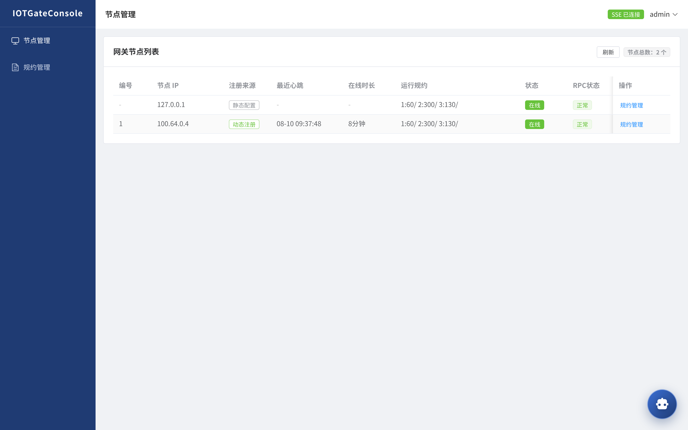
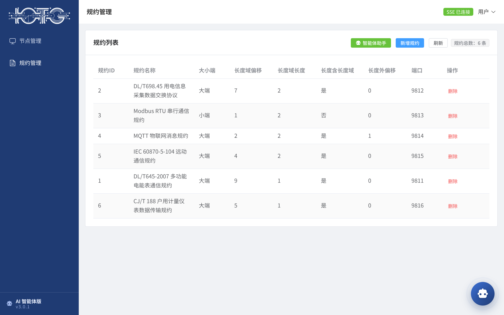
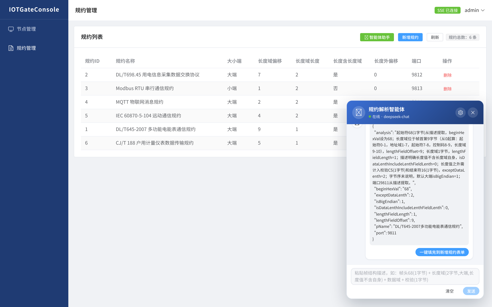
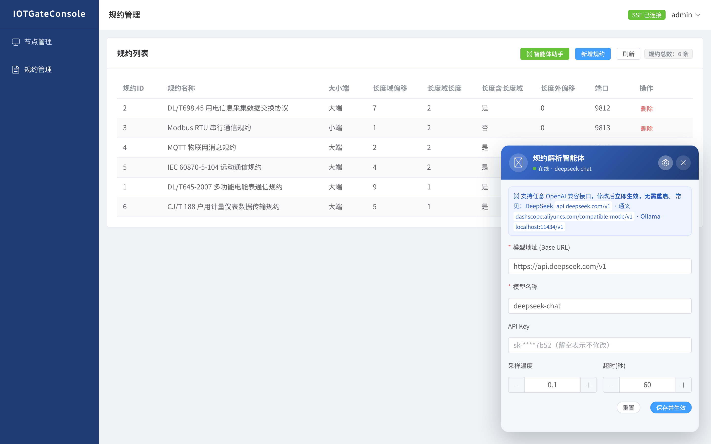

> ### 版本升级公告（2026-08）
> **IOTGate 正式升级为 AI 智能体版本（v2.2）**，与 IOTGateConsole 智能体控制台配套，形成"网关 + AI 智能体管理平台"完整部署形态：
>
> - **AI 智能体（LangChain4j）**：粘贴协议**帧结构描述**，大模型自动提取长度域信息、推导拆包/黏包解码参数，一键填充规约表单
> - **动态节点发现**：网关 `-c -r` 主动注册 + 10s 心跳 + 404 自愈重注册，控制台实时监控节点状态
> - **规约远程管理**：在线开启/关闭/新增/删除多规约解析服务，变更实时同步网关
> - **大模型厂商无关**：支持 DeepSeek / 通义 / GLM / Ollama 等任意 OpenAI 兼容接口，可视化配置即时生效
>
> 管理平台（IOTGateConsole）：https://gitee.com/willbeahero/IOTGateConsole

### GitHub项目地址（源码优先更新码云仓库）
https://github.com/BrianApple/IOTGate

### 温馨提示
本项目的使用有一定的门槛，需要使用人员具备一定的物联网应用层协议知识，比如大小端、长度域等等

### IOTGate开源版（基于GPL-2.0开源，请自行阅读GPL-2.0并准守相关条款，企业用户建议优先获取企业版使用权限！）
演示地址http://113.31.103.53:8686/
	
用户名密码随意输入：

如果跳转报错则重新在地址栏输入http://113.31.103.xx:8686/  即可正常访问！服务器资源有限，请不要对网关在线压测，谢谢！！
 ** 👨‍💻👨‍💻👨‍💻服务器被被挖矿木马感染了,目前木马已经被干掉,万事为了珍惜我宝贵的服务器资源就暂时不提供演示版了 **
	
### 名词解释
通信规约：应用层通信协议，与有些同学说的的“通信协议”是一个意思

### IOTGate开源版压测聚合报告
win10笔记本，堆内存2g,线程数6k

### 通过netty实现自定义协议物联网网关（单机和集群版）
window笔记本电脑本地测试：**单网关**、**单前置节点**，每秒处理并发心跳8000+（根据jmeter本地最新压测统计数据），20W在线终端(长连接保持)内存占用量1G左右

### 心跳检测
单机版可以通过配置文件个性化配置规约的心跳周期，集群版默认300秒
### 入口类:
	Entrance.java
	
### IOTGate操作指南--系列博客
於之博客：  https://www.xianglong.work/tag/IOTGate%E6%99%BA%E8%83%BD%E7%BD%91%E5%85%B3
	
於之CSDN: https://blog.csdn.net/sinat_28771747/category_8788959.html

### 端口占用
- kernel模式默认端口为：10915 （-k命令行参数开启）
- rpc通信：10916 (集群模式下开启，Console经此端口调用网关规约启停等RPC)
- 前置(master)数据通道：8888 （-m参数直连）

### 命令行参数说明

|      参数      | 是否必选 |是否含参| 含义 |
|------------- |----------|----------|----------|
| 		-n	   |	是  | 是  | 网关编号  |
| 		-c	   |	否  | 否  | 开启"主动注册到前端管理服务(IOTGateConsole)"，需配合-r指定Console地址  |
| 		-r	   |	否  | 是  | 前端管理服务(Console)地址，支持 ip / ip:port / http://ip:port，默认端口8686，如 192.168.1.10:8686  |
| 		-m	   |	否  | 是  | 前置ip地址(不含端口，前置默认8888)  |
| 		-k	   |	否  | 否  | 开启kernel模式，默认端口为10915  |
| 		-f	   |	是  | 是  | 配置文件"iotGate.conf"的本地全路径   |

### 如何启动
自行将项目打成jar包，在linux下，执行java -jar iotGate.jar -n  1 [args...]  默认前置端口为8888，可自行源码中修改
 - 单机方式启动 ：命令行参数使用“-m”指定前置服务地址 
 - 集群方式启动：命令行参数“-c -r”开启"主动注册到前端管理服务"模式，“-r”指定IOTGateConsole地址（支持 ip 或 ip:port，默认端口8686），同时“-m”指定前置服务地址（逗号分隔；v2.0起去除zookeeper依赖，通过-m直连前置，数据通道零改动）
   - 注册成功后网关每10s向Console发送心跳，Console侧30s未收到心跳自动判离线；网关正常关闭时主动反注册
   - Console侧注册表与静态 gate.nodes 配置并存：主动注册的节点优先，静态配置兜底

### 部署形态（网关 + 管理平台可选搭配）
IOTGate 网关与 IOTGateConsole 管理平台是两个独立工程，组合成完整部署形态，**二者可选搭配**：
- **仅网关（最小部署）**：只用 `-m` 直连前置，无需管理平台，数据通道零依赖
- **网关 + 管理平台（推荐）**：网关 `-c -r <consoleIp>` 主动注册到 IOTGateConsole，Console 提供节点监控、规约启停管理、AI 智能体等能力，形成完整的"网关-控制台"管理闭环
- 管理平台（IOTGateConsole）为 Spring Boot 3.5 Web 工程，默认端口 **8686**，项目地址：https://gitee.com/willbeahero/IOTGateConsole
- 使用前提：管理平台需配置 MySQL（本机 13306/3306 均可，见其 README）并启动；网关侧无需任何配置依赖 Console 的注册表，未启动 Console 时网关仅以 `-m` 模式运行，不影响数据通道

### 自定义网关头结构与注意事项
 
 网关报头，是网关与前置通信时，作为网关登录和传输真实报文时携带网关自身和终端响应参数的报文，报文结构是自己定义，前置按照定义好的报文格式获取数据并做相应处理。
 网关头结构如下：
 
| 报文属性      | 字节数| 含义 |
|------------- | ------------- | ----------|
| 		AB			|		 1byte | 报文头 |
| 		len			|	     4byte | 长度域：真实报文长度，包含“68”，“16”|
| 		type		|		 1byte | 报头类型|
| 		protocolType|	     1byte | 协议类型（左侧起第一个bit为0 表示IPV4, 1表示IPV6  剩余7个bit表示规约类型编号）|
| 		gateNum		|         1byte | 网关编号|
| 		00*12		|		 12byte |如果ip格式为IPV4，则当前为12字节0，反之，当前得12个byte+后续得4byte存放IPV6的值，存放顺序从左至右依次|
| 		clientIP	|		 4byte | 终端的IP地址，ip地址的每个段位占一个字节（不含符号和端口号）|
|		port		|     2byte | 终端对应的端口号|
|		count		|     4byte | 终端与网关建立连接时对应的连接序号（1-10000循环）|
 		
网关发送需要向前置发送登录报文，将自己注册到前置服务中，报文说明如下：

- 1. 登录时长度为0；有真实报文时，长度域为整个真实报文长度值
- 2. 登录时type = 03；protocolType=15;count=1都为固定值；发送真实报文时，type=01,protocolType=00;count=终端与网关的连接序号
- 3. 前置发现报头长度为0 且type = 03; protocolType=15;就不会执行解析数据的方法，否则会继续解析真实报文

***************************************************************************************************************************

### 网关配置文件种默认支持的两种真实报文
	*“真实报文”即终端与网关通信时传输数据的报文，规约不同则报文结构差异明显
- 规约编号为“1”，报文结构如下

| 报文属性      | 字节数| 含义 |
|------------- | ------------- | ----------|
|68			|		 1byte  |   报头|
|		len			|		  2byte  |   长度域 "传输帧中除起始字符68和结束字符16之外的帧字节总数，包含长度域本身字节数"|
|		data				|	  n byte |  报文内容 |
|		16            |        1byte  |   报尾|
- 规约编号为“2”，报文结构如下

| 报文属性      | 字节数| 含义 |
|------------- | ------------- | ----------|
|		len			|		  4byte  |   长度域值为data的字节数，不包含自身字节数|
|		data				|	  n byte |  报文内容 |

***
### 版本

- IOTGate-v1.0 版本为集群版网关程序，通过命令行参数动态配置网关为单节点或集群（单节点不依赖zookeeper集群）  网关与前置通讯时默认轮询方式负载均衡
- IOTGate-v2.0.1.release   IOTGate第一个正式稳定版本，可用于生产环境直接运行 !
- IOTGate-v2.0.2.release    解决了大家反应的一些bug，优化了内存泄漏异常，单机版本增加了配置单个规约心跳的配置选项，使得不同规约心跳的管理更加灵活！
- IOTGate-v2.0.3  IOTGate第一个正式发行版，可执行jar包下载地址 ：https://gitee.com/willbeahero/IOTGate/attach_files/454348/download
前置网关演示demo下载 ：https://gitee.com/willbeahero/IOTGate/attach_files/454354/download		
- **IOTGate v2.2（AI 智能体版，2026-08 正式升级）**：内置 LangChain4j AI 智能体，配合 IOTGateConsole v2.2 智能体控制台（节点监控/规约启停/AI 对话解析），形成完整智能体部署形态
- master 基本功能开发完成，已经支持多规约本地配置以及IOTGateConsole远程开启/关闭/新增/删除网关多规约服务功能。后续master会继续扩展相关功能
- **master（2026-08 架构演进）**：去除 Zookeeper 依赖（集群模式改 `-m` 直连前置，数据通道零改动）；新增 `-c -r` 网关主动注册模式（HTTP 注册 + 10s 心跳 + 404 自愈重注册），与 IOTGateConsole v2.2 智能体版（节点监控/规约启停/AI 智能体）配套形成完整部署形态

- IOTGate-v3.x 开发中，IOTGate智能物联网通信网关，支持大模型MCP协议，实现基于大模型交互对话以创建IOTGate通信协议代理

### 多规约支持
#### modbus TCP
报文结构：
配置信息：1,1,-1,4,2,0,0,9813,60

#### IEC 104
配置信息：2,1,-1,1,1,0,0,9814,60

#### DLT 645
配置信息：3,0,-1,9,1,0,2,9815,60

### IOTGate功能架构图

### GATE CLUSTER 结构图

注：图中GATE CLIENT（项目名称“IOTGateConsole”，项目地址：https://gitee.com/willbeahero/IOTGateConsole ） 是一个 Spring Boot 3.5 Web 工程，用户登录之后可以查看当前 GATE CLUSTER 的运行状态监控，并可执行网关规约解析服务的启动、关闭、新增、删除等操作：

- **节点管理**：实时展示网关节点列表，区分**动态注册**（网关 `-c -r` 主动注册，含最近心跳、在线时长）与**静态配置**（application.properties 中 gate.nodes 兜底）两种来源，节点在线状态、RPC 连通状态一目了然

- **规约管理**：远程开启/关闭/新增/删除网关多规约解析服务，规约参数（大小端、长度域偏移/长度、端口等）在线维护，变更实时同步到网关

- **AI 智能体（v2.2）**：内置 LangChain4j 悬浮机器人，粘贴协议**帧结构描述**即可由大模型自动提取长度域信息，推导拆包/黏包解码参数并一键填充到规约表单

- **大模型配置**：厂商无关（DeepSeek/通义/GLM/Ollama 等任意 OpenAI 兼容接口），可视化修改模型地址/Key/温度等，保存即时生效无需重启

更多关于IOTGateConsole的说明请到博客中查看 
 
### 计划新增功能
IOTGate Agent升级

### IOTGate最新功能
#### kernel服务模式

IOTGate最新支持与master节点通信“kernel”模式，下图中，红色实现框部分为normal部署模式，黑色虚线框部分为最新支持的kernel模式，即master节点和所有的感知终端统一作为
与IOTGate服务网络通信的客户端服务

### 部分已知用户

#### 排名先后按联系作者时间顺序无特殊含义（欢迎其他使用该项目的优秀用户联系作者将贵公司名称加入本页）：

- :+1: 烟台华崟科技有限公司

- :+1: 深圳风扇屏技术有限公司

- :+1: 杭州物新驱动科技有限公司

- :+1: 杭州数仓网络科技有限公司 （http://www.datanode.cn/ ）

- :+1: 车浴美汽车服务有限公司 (官方微信公众号： 车浴美)

### HXAPIGate（零侵入式API网关）
HXAPIGate是一款基于Netty+Shiro开发的一款高性能零侵入式API网关（被代理微服务不需要任何添加代码或注解，真正的零侵入即可实现分布式特性），适用于REST微服务的API资源授权管理等。项目地址： https://gitee.com/willbeahero/HXAPIGate

### 浩欣泛在物联网云平台【简称：浩欣物联平台】  软著登记号：2020SR0374701 官网：www.uiotp.com
   #### 演示账号 
用户名 guest001  密码 123456
   #### 简介

浩欣物联平台采用分布式微服务架构、分布式消息队列、分布式缓存、时序数据存储、流计算等技术实现的支持物联设备遥测数据采集、告警数据预警等功能的泛行业IOT物联网平台，可作为物联网上层应用的物联数据中台， 负责与各种不同规约类型的物联设备直接交互，并为上层应用提供统一的接口和响应数据格式能极大降低物联网研发的成本提高物联网研发效率。浩欣物联平台设备侧采用IOTGate企业版作为物联感知设备网络入口。浩欣物联平台受著作权保护，有兴趣的朋友可发邮件至 yangcheng068@foxmail.com
